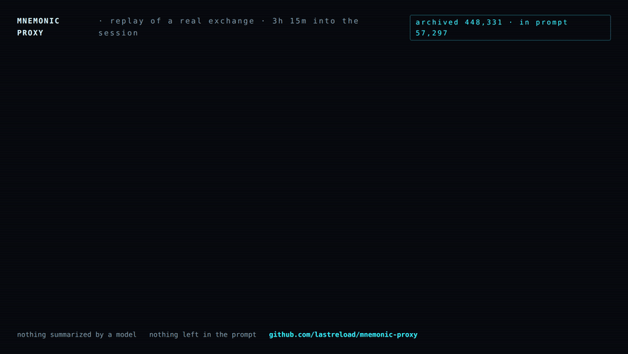

<p align="center">
  
</p>

<h1 align="center">Mnemonic Proxy</h1>

<p align="center"><em>Like Johnny, your agent carries more than its head can hold — and keeps working for hours.</em></p>

<p align="center">
  <a href="LICENSE"></a>
  
  <a href="https://lastreload.github.io/mnemonic-proxy/"></a>
</p>

<p align="center">
  
</p>

A transparent HTTP proxy that sits between a coding agent and a local model (llama.cpp's `llama-server`,
[Strata](https://github.com/Niko1221/Strata), or any OpenAI-compatible server). The agent keeps sending its whole,
unmodified history; the proxy decides what the model actually reads. Old material leaves the prompt but is never
summarized away: every message, tool call and output stays on disk, verbatim, and the model can pull any of it back.

It speaks OpenAI Chat Completions, Anthropic Messages and OpenAI Responses. Python ≥ 3.10, standard library only.

Developed and benchmarked primarily with [Strata](https://github.com/Niko1221/Strata), by Niko1221 and contributors.
mnemonic-proxy is an independently maintained project that also supports llama-server and other OpenAI-compatible
backends; saved engine state depends on what the backend supports (see [Engines](#engines)).

Project page: <https://lastreload.github.io/mnemonic-proxy/>

## One session, measured

A real coding session — a canvas tower-defense game built from scratch by a 35B-A3B MoE model on a single 12 GB
RTX 4070 Ti — with the proxy in between.

<p align="center">
  
</p>

<p align="center"><sub>Replay of a real exchange (animated GIF; <a href="docs/assets/replay.mp4">MP4</a>).
Three hours and two segment switches into the session, one <code>recall</code> call — resolved inside the proxy in
61 ms — brings back the verbatim first version of the boss block, message 20. No model summarized anything.</sub></p>

| | |
|---|---|
| **448K** | tokens of history archived and recallable |
| **105K** | peak tokens actually in the prompt (window: 128K) |
| **3h15** | continuous agent work · 430 requests · 0 errors |
| **1.4 s** | to resume a 110K-token conversation from disk (≈50 s re-reading it) |

<p align="center">
  
</p>

Magenta: the full history of the session. Cyan: what the model actually reads on each request. Dashed lines: the two
segment switches (≈2 minutes each, written handoff notes). Data from the proxy journal, 5 Oct 2026.

## How it works

No summaries written by a model, no vector database required.

1. **Hide — mask, don't summarize.** Old tool outputs and reasoning leave the prompt in stable blocks and become
   one-line receipts with an id. The prefix stays byte-identical between blocks, so the engine's KV cache keeps
   working.
2. **Recall — structured, exact.** A `recall` tool searches the verbatim archive: first write of a file, its full
   edit timeline, command → output, the reasoning behind an edit — every hit tagged with message number and segment.
   The proxy runs these calls itself; the client never sees them, even when streaming.
3. **Segment — handoff notes.** When even the masked window fills up, the model writes its own notes, the segment is
   sealed and a fresh one starts. Pinned lines (`!!` or `📌`) survive every switch; lines starting with `🗑` (or `~`)
   mark a message as disposable once answered.
4. **Save — engine state on disk.** On engines that support it (llama-server, Strata with session files) the KV
   state is saved to disk: resuming after a pause, a restart or another client takes 1–3 s instead of a full
   re-read.
5. **Archive — deduplicated cold storage.** Old state files are rebuilt bit-for-bit from content-addressed zstd
   blocks: −36% disk on our sessions, sha256-verified before every restore.
6. **Lean — tools on demand.** Agents ship tens of thousands of tokens of tool definitions. The proxy keeps the core
   ones and loads the rest by name: 25.6K → 6.2K tokens on every request.

> "In the courier business you don't read the payload. You carry it, and you give it back exactly as it was." — the
> design rule. Hidden content is never paraphrased; it is either in the prompt or retrievable verbatim.

## Recall, benchmarked

71 questions about past sessions, each with the known location of the evidence (including 8 with no answer in the
archive). Held-out split:

| | keyword search | structured recall |
|---|---|---|
| evidence found within 5 calls | 90% | 100% |
| tokens returned per question | 5,940 | 2,737 |
| "not in the archive" recognised | 1 / 4 | 4 / 4 |

The benchmark guided development, so read it as a regression suite, not an independent score. Its archives are real
private sessions and are not in this repository: `bench/` runs against your own archives (`bench/data/<name>.sqlite`)
with questions written for them. Details: [docs/dev-notes/RECALL-RESULT.md](docs/dev-notes/RECALL-RESULT.md)
(Italian).

## Saved state, measured

Resuming a conversation instead of re-reading it:

| case | saved | re-read |
|---|---|---|
| Strata (session-files branch), 110K tokens, RTX 4070 Ti | 1.4 s | ≈50 s |
| Strata (session-files branch), 69K tokens, after restart | 2.9 s | 33 s |
| llama-server, 8.2K tokens, CPU, Qwen3-0.6B | 1.9 s | 28.6 s |

Times are for restoring the conversation's context; loading the model is separate.

### Why saved state matters

A long agent conversation is expensive to rebuild: every token of it has to be processed again (prefill) before the
model can answer. Without saved state that cost is paid again each time the engine loses the conversation — after a
restart, when another client or conversation used the engine in between, and when the proxy returns to a sealed
segment. On a single 12 GB GPU that is close to a minute for 100K tokens; restoring the saved state takes a second or
two, and the state lives on disk, not in VRAM.

This is not specific to the proxy: any client that keeps long conversations on a local engine benefits.
llama-server already offers it through `--slot-save-path`. For Strata it is proposed in
[PR #668](https://github.com/Niko1221/Strata/pull/668), which has not been merged; until then it requires building
Strata from the `session-files` branch (see [Engines](#engines)). This note will be updated when upstream support
lands.

## Quick start

Three levels. Each one stands on its own.

| | what you see | needs | time |
|---|---|---|---|
| **T0 — see it work** | archive, masking, exact recall, with a scripted fake model | Python ≥ 3.10, git | 1 minute |
| **T1 — real model on CPU** | a real agent (pi) writing code through the proxy, masking, recall, resume after an engine restart | + cmake, a C++ compiler, Node.js ≥ 22.19, ~4 GB RAM, 2.5 GB disk | ~30 minutes |
| **T2 — real use (GPU)** | your own model and agent, long sessions | a GPU engine | — |

Commands are for Linux; see [Platforms](#platforms) for macOS and Windows (WSL).

### T0 — see it work (1 minute, no model)

```sh
python3 -m venv mnemonic-venv && . mnemonic-venv/bin/activate
pip install git+https://github.com/lastreload/mnemonic-proxy
mnemonic-proxy demo
```

The demo starts the real proxy in a temporary folder, in front of a scripted fake model. An agent reads a long
`build.log` that contains one build id; the session grows until the proxy hides the log; the demo prints what the
engine receives in its place (a one-line receipt); then the user asks for the build id, the model calls `recall`,
the proxy answers it internally and the archived text is compared byte for byte with the original. It ends with
`PASS` (exit 0) or `FAIL` (exit 1).

It proves the proxy's own logic: archive, masking, recall. It does not prove anything about a real model, its tool
calling, or saved engine state — that is T1.

### T1 — a real model on CPU

Tested end to end in a clean Ubuntu 24.04 container (see [Tested combinations](#tested-combinations)). A 4B model on
CPU is slow (seconds per answer) and limited: the point is to see every mechanism work, not to do real work.

**0. Prerequisites** (Ubuntu/Debian; other systems: [Platforms](#platforms)):

```sh
sudo apt install git cmake build-essential python3-venv curl
```

and Node.js ≥ 22.19 for pi (<https://nodejs.org/en/download>, or your package manager).

**1. Folder, proxy, example config.**

```sh
mkdir mnemonic-trial && cd mnemonic-trial
git clone --depth 1 https://github.com/lastreload/mnemonic-proxy
python3 -m venv .venv && . .venv/bin/activate
pip install ./mnemonic-proxy
cp mnemonic-proxy/examples/config.llama-server-8k.json .
mkdir -p slots data
```

**2. llama.cpp, the tested release (CPU build, ~2 minutes on 12 cores).**

```sh
git clone --depth 1 --branch b11430 https://github.com/ggml-org/llama.cpp
cmake -S llama.cpp -B llama.cpp/build -DCMAKE_BUILD_TYPE=Release
cmake --build llama.cpp/build --config Release -j 8 --target llama-server
```

**3. The model**: Qwen3-4B-Instruct-2507, Q4_K_M (2.5 GB). Qwen publishes no GGUF for this model
([model card](https://huggingface.co/Qwen/Qwen3-4B-Instruct-2507)); this is the
[Unsloth conversion](https://huggingface.co/unsloth/Qwen3-4B-Instruct-2507-GGUF), pinned to the tested revision:

```sh
mkdir -p models
curl -L -o models/Qwen3-4B-Instruct-2507-Q4_K_M.gguf \
  https://huggingface.co/unsloth/Qwen3-4B-Instruct-2507-GGUF/resolve/a06e946bb6b655725eafa393f4a9745d460374c9/Qwen3-4B-Instruct-2507-Q4_K_M.gguf
sha256sum models/Qwen3-4B-Instruct-2507-Q4_K_M.gguf
# 3605803b982cb64aead44f6c1b2ae36e3acdb41d8e46c8a94c6533bc4c67e597
```

**4. The engine** (terminal 1, inside `mnemonic-trial`):

```sh
llama.cpp/build/bin/llama-server -m models/Qwen3-4B-Instruct-2507-Q4_K_M.gguf \
  -c 8192 --parallel 1 --jinja --slot-save-path ./slots --port 8095
```

Wait for the line `listening on http://127.0.0.1:8095` (about 2 s once the model file is cached; `curl -s
localhost:8095/health` answers `{"status":"ok"}`). `--slot-save-path ./slots` is what makes saved state
possible, and it must be the same folder as `slot_dir` in the config (`./slots`). `--jinja` is already the default in
this build; it is written out because tool calling depends on it. `-c 8192` keeps memory small and makes the proxy
work early: a window of 8K fills up after a few tool outputs.

**5. Check, then start the proxy** (terminal 2, inside `mnemonic-trial`, venv active: `. .venv/bin/activate`):

```sh
mnemonic-proxy check --live --upstream http://127.0.0.1:8095 --port 8096 --data ./data --config config.llama-server-8k.json
mnemonic-proxy --upstream http://127.0.0.1:8095 --port 8096 --data ./data --config config.llama-server-8k.json
```

`check` must end with `READY` (exit 0): engine recognised as llama.cpp, model loaded, window taken from `n_ctx`
(8192) with the thresholds scaled to it, saved state supported and configured, and — because of `--live` — one
real generation, one tool call, one save/restore whose file appeared in `./slots`. Each failing line says how to fix
it; see also [Troubleshooting](#troubleshooting). The proxy then prints
`[mnemonic-proxy] 127.0.0.1:8096 -> http://127.0.0.1:8095 (engine llama.cpp, saved state yes) ... window=8192`.

**6. pi, the coding agent** (terminal 3). Install the tested version:

```sh
npm install -g --ignore-scripts @earendil-works/pi-coding-agent@1.0.3
```

Create `~/.pi/agent/models.json` (if it exists, add the `mnemonic` entry to its `providers`):

```json
{
  "providers": {
    "mnemonic": {
      "baseUrl": "http://127.0.0.1:8096/v1",
      "api": "openai-completions",
      "apiKey": "local",
      "compat": { "supportsDeveloperRole": false, "supportsReasoningEffort": false },
      "models": [
        { "id": "local-model", "name": "local model via mnemonic-proxy", "reasoning": false,
          "contextWindow": 131072, "maxTokens": 2048 }
      ]
    }
  }
}
```

and `~/.pi/agent/settings.json` (if it exists, add these three keys):

```json
{
  "defaultProvider": "mnemonic",
  "defaultModel": "local-model",
  "compaction": { "enabled": false }
}
```

`compaction.enabled: false` matters: pi's own auto-compaction would summarise the history the proxy is managing.
`contextWindow` is the *virtual* window the client sees (131072), not the engine's 8192: pi subtracts the prompt size
from it to choose `max_tokens`, and with 8192 it asks for 1 token as soon as the history grows. Fitting the history
into the engine's real window is the proxy's job. `apiKey` is a placeholder (the proxy does not check it); the model
id is any name, llama-server serves its loaded model.

**7. The exercise.** In terminal 3, a folder with a log whose one interesting line is buried in the middle:

```sh
mkdir -p ~/mnemonic-exercise && cd ~/mnemonic-exercise
python3 -c "for i in range(150): print('[%04d] compiling module_%03d.c ... ok (%d ms)' % (i, i, 80 + i * 7 % 61) if i != 97 else '[0097] build id: BUILD-7f3a9c-ORCHID-42')" > build.log
pi
```

Type these requests one at a time and wait for each answer (or non-interactively, same session:
`pi -p "<request 1>"`, then `pi -c -p "<request 2>"`, …):

1. `Run python3 -c "import uuid; print(uuid.uuid4())" and tell me the value.` — a `bash` tool call; pi repeats the
   value.
2. `Run cat build.log and tell me whether every module compiled.` — a long output (≈3K tokens).
3. `Write primes.py with a function first_primes(n) that returns the first n prime numbers, and test_primes.py with
   three unittest tests. Run the tests.` — `write` calls, then `bash`. The 8K window is now full: the proxy hides
   the oldest outputs behind a receipt. Nothing is printed; check with
   `grep -c '"event": "mask"' ~/mnemonic-trial/data/journal.jsonl` (≥ 1).
4. `Add a function is_prime(n) to primes.py and a test for it in test_primes.py, then run the tests.`
5. `What build id is written in build.log? Do not run commands and do not read files.` — the log is no longer in the
   prompt, only its receipt; the expected path is a `recall` call answered by the proxy itself (pi never sees it):
   `grep -c '"event": "recall"' ~/mnemonic-trial/data/journal.jsonl`. Small models often skip it: see the results
   below.

Wait one minute (the proxy saves the engine state after 60 s idle: `"event": "autosave"`), then restart the engine:
Ctrl+C in terminal 1, start it again with the same command, and ask `Which files did you write in this session?`.
The proxy restores the conversation from `./slots` instead of re-reading it:
`grep '"event": "autorestore"' ~/mnemonic-trial/data/journal.jsonl` shows the restored tokens and milliseconds.

What this proves and what it does not, for this model: see [Tested combinations](#tested-combinations).

### T2 — real use (GPU)

Use the engine and model you already have; the only requirements are an OpenAI-compatible endpoint and, for saved
state, an engine that can save its KV state to disk:

```sh
llama-server -m your-model.gguf -c 131072 --parallel 1 --jinja --slot-save-path /path/to/slots --port 8095
mnemonic-proxy check --upstream http://127.0.0.1:8095 --port 8096 --data ./data --config config.json
mnemonic-proxy --upstream http://127.0.0.1:8095 --port 8096 --data ./data --config config.json
```

with `config.json` = `examples/config.llama-server.json` and `slot_dir` = the same `/path/to/slots` (see
[Configuration](#configuration) for the recommended fields). With an engine that has no saved state (vLLM, online
APIs) the proxy runs in base mode. The measurements at the top of this page (35B-A3B MoE, 128K window) come from
Strata built from its session-files branch on a 12 GB RTX 4070 Ti — see [Engines](#engines); they say nothing about
other hardware.

The proxy recognises the engine at startup and turns off, with a warning, whatever the engine cannot do
(`--engine auto|strata|llama.cpp|ds4|openai` forces it). `ctxproxy` is kept as an alias of `mnemonic-proxy`.
Optional: `--tokenizer` (a Hugging Face `tokenizer.json`, or a Strata pack `tokenizer/` folder; needs
`pip install 'mnemonic-proxy[exact] @ git+https://github.com/lastreload/mnemonic-proxy'`) for exact token counts
instead of a chars/3.5 estimate; with llama-server, `"engine_tokenize": true` counts through its `/tokenize`. A
systemd user unit is in [examples/mnemonic-proxy.service](examples/mnemonic-proxy.service).

Disable the agent's own auto-compaction in every client below, otherwise two context managers fight over the same
history.

### pi, Hermes, Continue, … (Chat Completions)

Point the client's OpenAI base URL at `http://127.0.0.1:8096/v1`. For pi, the two files of T1 step 6 (with your real
`contextWindow`/`maxTokens`). For other clients: their OpenAI-compatible provider setting, plus their own way to turn
off context compaction.

### Claude Code (Anthropic Messages, experimental)

Checked against Claude Code 2.1.287:

```sh
export ANTHROPIC_BASE_URL=http://127.0.0.1:8096      # no /v1
export ANTHROPIC_AUTH_TOKEN=local                    # any value; the proxy does not check it
export ANTHROPIC_MODEL=local-model                   # any name; the engine serves its loaded model
export ANTHROPIC_DEFAULT_HAIKU_MODEL=local-model     # background tasks (replaces ANTHROPIC_SMALL_FAST_MODEL)
export CLAUDE_CODE_DISABLE_NONESSENTIAL_TRAFFIC=1    # fewer side requests competing for the engine
export DISABLE_AUTO_COMPACT=1                        # turns off auto-compaction; /compact still works
claude
```

`ANTHROPIC_SMALL_FAST_MODEL` is still read by 2.1.287 (it takes precedence), but the documented name is
`ANTHROPIC_DEFAULT_HAIKU_MODEL`. `DISABLE_COMPACT=1` would also turn off the manual `/compact`.
`POST /v1/messages` (streaming and not) and `POST /v1/messages/count_tokens` are supported. Thinking blocks get a
local placeholder signature: a session started through the proxy cannot be continued on Anthropic's API.

### Codex (OpenAI Responses, experimental)

Codex 0.160 speaks only the Responses API (`wire_api = "chat"` is rejected). In `~/.codex/config.toml` (or a separate
`CODEX_HOME`):

```toml
model = "local-model"
model_provider = "local"
model_context_window = 131072              # the proxy's window; Codex compacts relative to this
model_auto_compact_token_limit = 100000000 # compaction threshold far above any real session

[model_providers.local]
name = "local engine via mnemonic-proxy"
base_url = "http://127.0.0.1:8096/v1"
wire_api = "responses"
env_key = "LOCAL_API_KEY"          # export LOCAL_API_KEY=local (any value)
requires_openai_auth = false
supports_websockets = false
```

Codex 0.160 has no setting that turns auto-compaction off: `model_auto_compact_token_limit` only moves the
threshold. Set it far above any session, as above, so that in practice the proxy is the only context manager.
Codex's `prompt_cache_key` is used as the conversation key. Stateless only (`store=false`, no
`previous_response_id`), which is what Codex sends.

### MCP recall server (Claude Code, Codex, Hermes)

The archive can also be searched from any MCP client, read-only (sqlite `mode=ro`; the proxy can keep writing). Three
tools: `recall` (same search as the proxy's tool), `conversations`, `journal`.

```sh
mnemonic-mcp --db ./data/archive.sqlite                 # stdio
mnemonic-mcp --db ./data/archive.sqlite --http 8133     # streamable HTTP on 127.0.0.1:8133/mcp
```

```sh
claude mcp add mnemonic -- mnemonic-mcp --db /path/to/data/archive.sqlite
codex mcp add mnemonic -- mnemonic-mcp --db /path/to/data/archive.sqlite
hermes mcp add mnemonic --command mnemonic-mcp --args --db /path/to/data/archive.sqlite
```

`python3 -m ctxproxy.mcp_server` is the same program. Hermes `config.yaml` equivalent:

```yaml
mcp_servers:
  mnemonic:
    command: mnemonic-mcp
    args: [--db, /path/to/data/archive.sqlite]
    enabled: true
```

### Dashboard (optional; needs the git clone; UI in Italian)

The dashboard is not part of the pip package: it runs from a clone of this repository, and its interface is in
Italian.

```sh
python3 mnemonic-proxy/dashboard/ctxdash.py --data ./data --strata http://127.0.0.1:8095 --proxy http://127.0.0.1:8096 --port 8097
```

Read-only, on `127.0.0.1:8097`: engine status, physical vs. virtual context over time, masking/segment/recall events,
and the live physical prompt (with `live_dump: true`).

### Proxy endpoints

Besides the client APIs (`/v1/chat/completions`, `/v1/messages`, `/v1/responses`), all other paths are passed to the
engine. The proxy's own:

| endpoint | what |
|---|---|
| `GET /health` | proxy + engine health: `{"status": "ok" \| "loading" \| "engine_unreachable", "engine", "version", "upstream"}`; HTTP 200 only when the engine is ready |
| `GET /v1/engine` | what was detected: `kind`, `slot_save` (saved state supported and on), `n_ctx`, `model`, `notes`. `GET /v1/strata/engine` is the same (0.1 name, kept) |
| `GET /v1/strata/conversations/<id>` | one conversation: archived messages, masks, segments |
| `GET /v1/strata/archive/<id>` | one archived block, verbatim |
| `GET /v1/strata/journal` | the last 200 journal events |

## Tested combinations

Run literally as written in T1, in a clean `ubuntu:24.04` container (12 CPU cores, no GPU, user without sudo),
llama.cpp `b11430` CPU build, pi 1.0.3, Node 22.23.3, Python 3.12, `config.llama-server-8k.json`, engine `-c 8192`
(2026-10-06).

| model | `check --live` | tool calls | masking | recall (step 5) | engine restart |
|---|---|---|---|---|---|
| Qwen3-4B-Instruct-2507 Q4_K_M (Unsloth) | READY | yes | yes: 5 masks, 4 segment switches | **no**: answered "cannot determine" instead of calling `recall` | autorestore 2450 tokens in 42 ms; next prompt 2486/2505 reused |
| Qwen2.5-Coder-7B-Instruct Q4_K_M (Qwen) | READY with warnings (no tool call) | **no**: writes the call as JSON text, same straight to llama-server | — | — | autorestore 3698 tokens in 17 ms |

What T1 proves: the proxy in front of a real llama-server — window read from the engine, thresholds scaled to 8K,
masking and segment switches under a real agent, state saved when idle and restored after an engine restart without
re-reading. What it does not prove: that a 4B model on 8K uses `recall` reliably (it did not, here), or that the
agent finishes the task — in step 4 the 4B model looped on read/edit until the timeout. Those depend on the model;
use T2 for real work.

Found while testing, fixed in 0.2.1: with the extended recall tool (`recall_struct`, `recall_multi`) in the tool
list, Qwen3-4B made 0/6 tool calls (4–6/6 without): the example configs keep the short `recall` tool.

## Troubleshooting

Start with `mnemonic-proxy check` (add `--live` to exercise the engine): every failing line says what to change.

| symptom | cause | fix |
|---|---|---|
| `check`: port … is in use | another proxy (or another program) on that port | stop it, or pass a different `--port` (and change the client's base URL) |
| `check`: engine answers 503 / `GET /health` says `loading` | llama-server is still loading the model | wait for `listening on …` in its log |
| `check`: engine not reachable | wrong `--upstream`, or the engine is not running | start the engine; `curl http://127.0.0.1:8095/health` must answer |
| llama-server: `failed to allocate` / killed | not enough memory for model + context | a smaller `-c`, a smaller quantisation, or a smaller model |
| HTTP 400 `exceeds the available context size` | the client asked for more than the window | proxy started with a config whose `window` is larger than the engine's `-c`? The proxy reads `n_ctx` from llama-server at startup: restart the proxy after changing `-c` |
| the model describes the command instead of calling a tool, or says it "cannot run commands" | chat template without tools, or a model weak at tool calling | llama-server with `--jinja`; `check --live` shows whether a tool call works; try a stronger model (see [Tested combinations](#tested-combinations)) |
| `check`: saved state supported by the engine, disabled in the proxy | config without `slot_save` | use `examples/config.llama-server.json` |
| `check --live`: the state file is not in `slot_dir` | `slot_dir` ≠ llama-server `--slot-save-path`, or the engine runs on another host / in a container with another path | the same folder, as seen from the proxy's host |
| `check`: engine detected as `openai` | llama-server too old, or another engine | saved state needs llama-server with `--slot-save-path`, or Strata's session-files branch; everything else works |
| Strata (official) has no saved state | the save endpoint is only in Strata's unmerged PR #668 | build Strata from the `session-files` branch, or use llama-server |
| answers get shorter and shorter / summaries appear in the history | the client's own compaction is on as well | turn it off: pi `"compaction": {"enabled": false}`, Claude Code `DISABLE_AUTO_COMPACT=1`, Codex: [threshold](#codex-openai-responses-experimental) |
| Codex: `wire_api = "chat"` rejected | Codex ≥ 0.160 only speaks the Responses API | `wire_api = "responses"` |
| `kv_archive` refused | needs Python ≥ 3.14 (`compression.zstd`) | Python 3.14, or leave `kv_archive` off (default) |

## Platforms

- **Linux**: the reference. Every tested combination below ran on Linux.
- **macOS**: the proxy is plain Python and should work as on Linux (not yet tested). Build llama.cpp the same way
  (Metal is on by default on Apple Silicon) or install it with Homebrew (`brew install llama.cpp`), then use the same
  `llama-server` command; `sha256sum` is `shasum -a 256`.
- **Windows**: use WSL 2 (Ubuntu) and follow the Linux commands inside WSL. Keep the engine, the proxy and the
  `slots` folder all inside WSL, so that `slot_dir` and `--slot-save-path` are the same path. Not yet tested.

## Uninstall

```sh
pip uninstall mnemonic-proxy        # inside the venv you installed it in, or delete the venv
rm -rf ./data                       # the archive, the journal: your conversations in plaintext
rm -rf ./slots                      # saved engine state (large files), and kv-archive/ if you used kv_archive
```

`./data` and `./slots` are separate on purpose: deleting the state files keeps the archive (recall still works, only
resuming without re-reading is lost); deleting `./data` loses the archive and the conversations' state becomes
unreachable. Undo the client changes as well (pi `models.json`/`settings.json`, the Claude Code variables, the Codex
provider).

## Engines

| client \ engine | Strata | llama-server | any OpenAI-compatible |
|---|---|---|---|
| Chat Completions (pi, Hermes, Continue…) | tested · full | tested on CPU · full | base (no saved state) |
| Claude Code (Anthropic Messages) | experimental | experimental | experimental |
| Codex (Responses) | experimental | experimental | experimental |
| MCP recall server (Claude Code, Codex, Hermes) | tested read-only on a real archive | | |

"Experimental": tested end to end against a mock engine and with short real client runs, not yet on long real
sessions.

- **llama.cpp** — start `llama-server` with `--slot-save-path DIR` for saved state (masking anchor, segment saved
  before a switch, autosave/autorestore, `kv_archive`). The window comes from the server's `n_ctx` unless `window` is
  set; with `--parallel N` the proxy pins one slot (`slot_id`, default 0). Without `--slot-save-path` the proxy runs
  in base mode.
- **Strata** — works as is in base mode. **Saved state requires the session-files patch, upstream PR pending:
  <https://github.com/Niko1221/Strata/pull/668>.** Until it is merged, build Strata from the `session-files` branch of
  the fork and start it with `--slot-save-path DIR`:

  ```sh
  git clone -b session-files https://github.com/maverde73/Strata
  cd Strata && ./setup.sh          # Strata's normal installer (Windows: START-HERE.bat)
  ```

  `examples/config.example.json` is the configuration used with session files;
  `examples/config.official-strata.json` the one for official Strata.
- **Generic OpenAI-compatible** (vLLM, online APIs, …) — base mode: masking, archive + `recall`, segments with
  handoff notes, 📌/🗑, streaming. No engine state, no saved files. Not tested on vLLM itself.
- **ds4-server** ([antirez/ds4](https://github.com/antirez/ds4)) — experimental, see below.

### ds4-server

ds4-server keeps its own state: with `--kv-disk-dir DIR` it checkpoints the KV cache to disk by text prefix and
resumes a conversation after a tool call by recognising the tool-call id (exact replay of the sampled call). So the
proxy does less than with other engines:

```sh
./ds4-server -m MODEL.gguf --ctx 65536 --port 8110 --kv-disk-dir ./kv
mnemonic-proxy --upstream http://127.0.0.1:8110 --port 8096 --data ./data --config examples/config.ds4.json
```

- Detection: `GET /v1/models` with `owned_by: "ds4.c"`; the window is taken from `context_length` (= `--ctx`).
  `engine: "ds4"` forces it.
- The proxy does not save, restore or archive engine state (`slot_save`, `mask_anchor`, `autosave`, `kv_archive`
  are turned off): ds4 does it itself.
- `mask_tool_args` is turned off: ds4 re-inserts the sampled call text by id, so shortened arguments would not
  reach the model. Set `ds4_exact_tool_replay: false` only if ds4-server runs with
  `--disable-exact-dsml-tool-replay`.
- Tool-call ids pass through unchanged in all three protocols (the id the engine generated reaches the client and
  comes back identical); internal `recall` calls keep the engine's id and are re-inserted identically next turn.
- Old reasoning is masked as usual; the last turn with tool calls keeps its reasoning.
- `checkpoint_align_tokens` (off by default): when set to ds4's checkpoint interval (by default 10240 tokens,
  `--kv-cache-continued-interval-tokens` rounded to `--kv-cache-boundary-align-tokens`), a masking block starts just
  after a multiple of it, so fewer tokens are re-read after the last disk checkpoint. Needs an exact `--tokenizer`
  to be meaningful. Not measured yet.
- Not proven: long real sessions; parallel sessions (`--batched-session N`) — the proxy still serialises requests.

`GET /v1/strata/engine` shows what was detected. Measurements: [docs/dev-notes/ENGINES-RESULT.md](docs/dev-notes/ENGINES-RESULT.md) (Italian).

## Configuration

`--config` takes a JSON object with any field of `ctxproxy.core.Config`. Defaults below are the real ones in the
code. Most features are off by default so that 0.1 behaviour is unchanged; the last column is what we recommend
with an engine that has saved state (`examples/config.example.json` plus the options the benchmarks above support).

| field | default | meaning | recommended |
|---|---|---|---|
| `window` | 131072 | physical context of the engine (llama-server: taken from `n_ctx` if unset) | 131072 |
| `mask_trigger` / `mask_target` | 80000 / 40000 | start a masking block above trigger, mask oldest-first down to target | default |
| `min_batch_tokens` | 16000 | a block runs only if it frees at least this much | default |
| `keep_recent_tokens` / `min_age_turns` | 16000 / 2 | protected tail, never masked | default |
| `mask_reasoning` / `mask_tool_args` | false / false | also mask old reasoning / large old tool-call arguments | **true / true** |
| `mask_anchor`, `anchor_min_tokens` | false, 24000 | save/restore engine state at the masking frontier (saved state) | **true**, 24000 |
| `slot_dir` | "" | the engine's `--slot-save-path` folder, same host (anchor cleanup, autosave, `kv_archive`) | set |
| `segments_enabled`, `tail_max`, `notes_max_tokens` | true, 24000, 8192 | segment switch with handoff notes | true, 24000, **12288** |
| `slot_save` / `seal_experimental` | false / false | save the old segment to disk before switching (saved state) | **true / true** |
| `response_floor` | 0 | minimum response size assumed in the window check | **16384** |
| `inject_recall`, `max_recall_rounds`, `recall_max_tokens` | true, 4, 6000 | the `recall` tool | default |
| `recall_tool_name` / `tools_tool_name` | "recall" / "tools" | names of the proxy's tools for new conversations | default |
| `recall_struct`, `recall_flex`, `recall_multi` | false, false, false | structured recall: file timelines, links, flexible words, several queries per call (the benchmark above) | **true, true, true** |
| `auto_recall` / `auto_recall_hint` | false / false | on each new user message, add relevant hidden pieces / only a one-line hint with ids | false / **true** |
| `tools_paging`, `tools_core` | false, read/bash/edit/write/grep/find/ls | tools on demand: only core tools + `recall` + `tools` in the prompt | **true** |
| `typed_receipts`, `receipt_guard` | true, true | typed one-line receipts for hidden outputs; block write/edit/bash that copy a receipt | default |
| `pins_max_tokens` | 8192 | cap of the carried-over 📌 block | default |
| `autosave`, `autosave_idle_s`, `autosave_keep`, `autosave_max_gb` | false, 180, 10, 25 | save engine state when the conversation is idle (saved state) | **true**, 180, 10, 25 |
| `autorestore`, `autorestore_min_gain` | true, 8192 | restore before forwarding when it saves at least this many tokens | default |
| `kv_archive`, `kv_archive_idle_s`, `kv_archive_min_age_s` | false, 600, 1800 | cold archive of state files (needs Python ≥ 3.14 for `compression.zstd`) | **true** |
| `engine`, `slot_id`, `engine_tokenize` | "auto", 0, false | engine type, slot, token counting via the engine's `/tokenize` | auto |
| `live_dump` | false | write `data/live/last_request.json` for the dashboard | **true** |

A config for llama-server with saved state, as recommended above:

```json
{
  "mask_reasoning": true, "mask_tool_args": true,
  "mask_anchor": true, "slot_dir": "/path/to/slots",
  "slot_save": true, "seal_experimental": true,
  "notes_max_tokens": 12288, "response_floor": 16384,
  "recall_struct": true, "recall_flex": true, "recall_multi": true, "auto_recall_hint": true,
  "tools_paging": true,
  "autosave": true
}
```

On a generic OpenAI engine drop the saved-state fields (`mask_anchor`, `slot_dir`, `slot_save`,
`seal_experimental`, `autosave`, `kv_archive`); the proxy turns them off anyway, with a warning.

### Tool names and older conversations

The proxy's own tools are called `recall` and `tools` (0.1 called them `strata_recall` and `strata_tools`). The tool
list is part of the prompt prefix, so conversations already in the archive from 0.1 keep the old names — renaming
them would force a full re-read and break saved state. New conversations get the new names. A call to the old names
is always resolved. If the client already declares a tool called `recall` (or `tools`), the client's tool is left
alone and the proxy uses `history_recall` (or `load_tools`) instead.

## What we have not proven

- Long-range quality is not free. Of six questions about the first hour of a 3-hour session, four were answered
  exactly, two partially (one value missed, one timeline mixed up). None were invented.
- The model does not attend to 448K tokens. It sees at most one window; the rest is recallable, not "in context".
- Segment switches cost ≈2 minutes of note-writing on a 12 GB GPU.
- Saved state on Strata needs the session-files patch (upstream PR pending).
- Claude Code and Codex adapters are tested against a mock engine, not yet on long real sessions.
- Recall search is lexical (FTS5 + structure), not semantic: a paraphrase with no shared words can miss.
- One sequence: the proxy serialises requests and assumes it is the engine's only client; another client on the
  same engine costs re-reads.
- Numbers come from single runs on one machine and one kind of workload; treat them as indicative.

## Security & privacy

- **Everything stays local.** The proxy talks only to the `--upstream` you give it; no telemetry, no update checks,
  no other network access. The dashboard and the MCP server bind to `127.0.0.1` and are read-only.
- **The archive is plaintext.** `data/archive.sqlite` holds everything the agent saw — file contents, command
  outputs, reasoning — secrets included. `data/journal.jsonl` holds request metadata and recall queries;
  `data/live/last_request.json` (with `live_dump`) the whole last prompt. Saved engine state files (`slot_dir`) and
  `kv-archive/` hold the conversation's tokens.
- The proxy binds to `127.0.0.1` by default and has no authentication; do not expose it (`--host`) on a shared
  network. The MCP server's HTTP mode also binds to `127.0.0.1`.
- Protect the folders: `chmod 700 ./data /path/to/slots`.
- There is no delete command yet. To forget a conversation, stop the proxy, then:
  1. find its id: the MCP `conversations` tool, or
     `sqlite3 data/archive.sqlite "SELECT conv, count(*) FROM archive GROUP BY conv"`
     (`GET /v1/strata/conversations/<id>` shows one conversation's stats);
  2. delete its rows: in `sqlite3 data/archive.sqlite`, for each table `archive chains masks segments inserts
     anchors pins autosaves drops fileops` run `DELETE FROM <table> WHERE conv='<id>';`, then
     `DELETE FROM kv WHERE k='tool_names:<id>';`, drop the structured-recall index (rebuilt on demand):
     `DROP TABLE IF EXISTS passages; DROP TABLE IF EXISTS passages_done; DROP TABLE IF EXISTS p_raw;
     DROP TABLE IF EXISTS p_norm;`, and finally `INSERT INTO archive_fts(archive_fts) VALUES('rebuild'); VACUUM;`;
  3. delete its state files in `slot_dir`: `<id>-seg*-A.bin`, `<id>-seg*-anchor*.bin`, `<id>-seg*-auto-*.bin`;
  4. in `kv-archive/manifests/` delete the matching `.kva` manifests, then
     `python3 -m ctxproxy.kvarchive --root /path/to/kv-archive gc` to drop unreferenced blocks;
  5. the journal is append-only: delete or filter `data/journal.jsonl` (lines with `"conv": "<id>"`).

## Tests

```sh
python3 -m unittest discover -s tests -t .
```

Uses a fake OpenAI-compatible engine (`tests/fake_engine.py`, also runnable stand-alone with
`python3 -m tests.fake_engine --port 18095`). Optional groups are skipped unless their inputs are present: exact
counting (a tokenizer in `./tok` or `CTX_TOKDIR`, plus `tokenizers`), Strata mock integration (`STRATA_DIR`, plus
`jinja2`), and `kv_archive` (Python ≥ 3.14). `tools/replay_dry.py` and `tools/replay_exact.py` replay a pi session
through the context manager offline.

Partly in Italian: code comments, the dashboard UI, the developer notes in `docs/dev-notes/`, and some text the model
reads — receipts and placeholders of hidden content, the handoff-note request, recall result headers. Those strings
are part of the stable prompt prefix of existing conversations, so they were not translated in 0.2.0. Tool
definitions for new conversations, the MCP tools, the CLI, startup logs and this README are in English.

## Credits & license

MIT — see [LICENSE](LICENSE). Built by Maurizio Verde — LastReload.

Thanks to Niko1221 and the [Strata](https://github.com/Niko1221/Strata) contributors for the inference engine that
made our large-model measurements possible on a single 12 GB GPU; to the [llama.cpp](https://github.com/ggml-org/llama.cpp)
contributors for llama-server and its slot save/restore API; and to the authors of pi for the coding agent used in our
experiments.

The name is a nod to William Gibson's courier, not affiliated with the story or the film.

```bibtex
@software{verde2026mnemonicproxy,
  author = {Verde, Maurizio},
  title  = {Mnemonic Proxy: long-running local coding agents with a verbatim archive},
  year   = {2026},
  url    = {https://github.com/lastreload/mnemonic-proxy}
}
```
