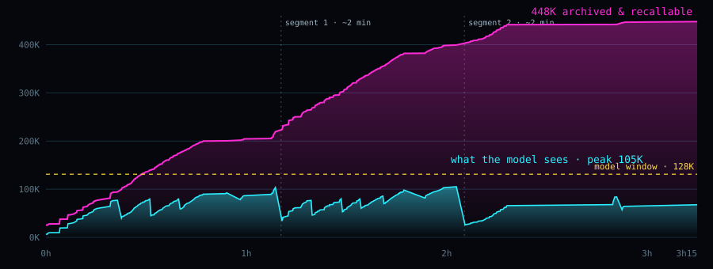

<p align="center">
  
</p>

<h1 align="center">Mnemonic Proxy</h1>

<p align="center"><em>Like Johnny, your agent carries more than its head can hold — and keeps working for hours.</em></p>

<p align="center">
  <a href="LICENSE"></a>
  
  <a href="https://lastreload.github.io/mnemonic-proxy/"></a>
</p>

<p align="center">
  
</p>

A transparent HTTP proxy that sits between a coding agent and a local model (llama.cpp's `llama-server`,
[Strata](https://github.com/Niko1221/Strata), or any OpenAI-compatible server). The agent keeps sending its whole,
unmodified history; the proxy decides what the model actually reads. Old material leaves the prompt but is never
summarized away: every message, tool call and output stays on disk, verbatim, and the model can pull any of it back.

It speaks OpenAI Chat Completions, Anthropic Messages and OpenAI Responses. Python ≥ 3.10, standard library only.

Project page: <https://lastreload.github.io/mnemonic-proxy/>

## One session, measured

A real coding session — a canvas tower-defense game built from scratch by a 35B-A3B MoE model on a single 12 GB
RTX 4070 Ti — with the proxy in between.

| | |
|---|---|
| **448K** | tokens of history archived and recallable |
| **105K** | peak tokens actually in the prompt (window: 128K) |
| **3h15** | continuous agent work · 430 requests · 0 errors |
| **1.4 s** | to resume a 110K-token conversation from disk (≈50 s re-reading it) |

<p align="center">
  
</p>

Magenta: the full history of the session. Cyan: what the model actually reads on each request. Dashed lines: the two
segment switches (≈2 minutes each, written handoff notes). Data from the proxy journal, 5 Oct 2026.

## How it works

No summaries written by a model, no vector database required.

1. **Hide — mask, don't summarize.** Old tool outputs and reasoning leave the prompt in stable blocks and become
   one-line receipts with an id. The prefix stays byte-identical between blocks, so the engine's KV cache keeps
   working.
2. **Recall — structured, exact.** A `recall` tool searches the verbatim archive: first write of a file, its full
   edit timeline, command → output, the reasoning behind an edit — every hit tagged with message number and segment.
   The proxy runs these calls itself; the client never sees them, even when streaming.
3. **Segment — handoff notes.** When even the masked window fills up, the model writes its own notes, the segment is
   sealed and a fresh one starts. Pinned lines (`!!` or `📌`) survive every switch; lines starting with `🗑` (or `~`)
   mark a message as disposable once answered.
4. **Save — engine state on disk.** On engines that support it (llama-server, Strata with session files) the KV
   state is saved to disk: resuming after a pause, a restart or another client takes 1–3 s instead of a full
   re-read.
5. **Archive — deduplicated cold storage.** Old state files are rebuilt bit-for-bit from content-addressed zstd
   blocks: −36% disk on our sessions, sha256-verified before every restore.
6. **Lean — tools on demand.** Agents ship tens of thousands of tokens of tool definitions. The proxy keeps the core
   ones and loads the rest by name: 25.6K → 6.2K tokens on every request.

> "In the courier business you don't read the payload. You carry it, and you give it back exactly as it was." — the
> design rule. Hidden content is never paraphrased; it is either in the prompt or retrievable verbatim.

## Recall, benchmarked

71 questions about past sessions, each with the known location of the evidence (including 8 with no answer in the
archive). Held-out split:

| | keyword search | structured recall |
|---|---|---|
| evidence found within 5 calls | 90% | 100% |
| tokens returned per question | 5,940 | 2,737 |
| "not in the archive" recognised | 1 / 4 | 4 / 4 |

The benchmark guided development, so read it as a regression suite, not an independent score. Its archives are real
private sessions and are not in this repository: `bench/` runs against your own archives (`bench/data/<name>.sqlite`)
with questions written for them. Details: [docs/dev-notes/RECALL-RESULT.md](docs/dev-notes/RECALL-RESULT.md)
(Italian).

## Saved state, measured

Resuming a conversation instead of re-reading it:

| case | saved | re-read |
|---|---|---|
| Strata, 110K tokens, RTX 4070 Ti | 1.4 s | ≈50 s |
| Strata, 69K tokens, after restart | 2.9 s | 33 s |
| llama-server, 8.2K tokens, CPU, Qwen3-0.6B | 1.9 s | 28.6 s |

## Quick start

```sh
# 1. an engine — llama.cpp with slot saving
llama-server -m model.gguf -c 131072 --slot-save-path ./slots --port 8095

# 2. the proxy (binds to 127.0.0.1 by default)
pip install git+https://github.com/lastreload/mnemonic-proxy
mnemonic-proxy --upstream http://127.0.0.1:8095 --port 8096 --data ./data
```

The proxy recognises the engine at startup and turns off, with a warning, whatever the engine cannot do
(`--engine auto|strata|llama.cpp|openai` forces it). `ctxproxy` is kept as an alias of `mnemonic-proxy`.
Saved-state features are off by default; to use them, pass a config file (see [Configuration](#configuration)):

```sh
mnemonic-proxy --upstream http://127.0.0.1:8095 --port 8096 --data ./data --config config.json
```

Optional: `--tokenizer` (a Hugging Face `tokenizer.json`, or a Strata pack `tokenizer/` folder; needs
`pip install 'mnemonic-proxy[exact] @ git+https://github.com/lastreload/mnemonic-proxy'`) for exact token counts
instead of a chars/3.5 estimate. A systemd user unit is in
[examples/mnemonic-proxy.service](examples/mnemonic-proxy.service).

Disable the agent's own auto-compaction in every client below, otherwise two context managers fight over the same
history.

### Chat Completions (pi, Hermes, Continue, …)

Point the client's OpenAI base URL at `http://127.0.0.1:8096/v1`, e.g.

```sh
OPENAI_BASE_URL=http://127.0.0.1:8096/v1 pi
```

For pi, add a provider with that base URL in `~/.pi/agent/models.json` and set
`"compaction": {"enabled": false}` in `settings.json`.

### Claude Code (Anthropic Messages, experimental)

```sh
export ANTHROPIC_BASE_URL=http://127.0.0.1:8096      # no /v1
export ANTHROPIC_AUTH_TOKEN=local                    # any value; the proxy does not check it
export ANTHROPIC_MODEL=local-model                   # any name; the engine serves its loaded model
export ANTHROPIC_SMALL_FAST_MODEL=local-model
export CLAUDE_CODE_DISABLE_NONESSENTIAL_TRAFFIC=1    # fewer side requests competing for the engine
export DISABLE_AUTO_COMPACT=1
claude
```

`POST /v1/messages` (streaming and not) and `POST /v1/messages/count_tokens` are supported. Thinking blocks get a
local placeholder signature: a session started through the proxy cannot be continued on Anthropic's API.

### Codex (OpenAI Responses, experimental)

Codex 0.160 speaks only the Responses API (`wire_api = "chat"` is rejected). In `~/.codex/config.toml` (or a separate
`CODEX_HOME`):

```toml
model = "local-model"
model_provider = "local"

[model_providers.local]
name = "local engine via mnemonic-proxy"
base_url = "http://127.0.0.1:8096/v1"
wire_api = "responses"
env_key = "LOCAL_API_KEY"          # export LOCAL_API_KEY=local (any value)
requires_openai_auth = false
supports_websockets = false
```

Codex's `prompt_cache_key` is used as the conversation key. Stateless only (`store=false`, no
`previous_response_id`), which is what Codex sends.

### MCP recall server (Claude Code, Codex, Hermes)

The archive can also be searched from any MCP client, read-only (sqlite `mode=ro`; the proxy can keep writing). Three
tools: `recall` (same search as the proxy's tool), `conversations`, `journal`.

```sh
mnemonic-mcp --db ./data/archive.sqlite                 # stdio
mnemonic-mcp --db ./data/archive.sqlite --http 8133     # streamable HTTP on 127.0.0.1:8133/mcp
```

```sh
claude mcp add mnemonic -- mnemonic-mcp --db /path/to/data/archive.sqlite
codex mcp add mnemonic -- mnemonic-mcp --db /path/to/data/archive.sqlite
hermes mcp add mnemonic --command mnemonic-mcp --args --db /path/to/data/archive.sqlite
```

`python3 -m ctxproxy.mcp_server` is the same program. Hermes `config.yaml` equivalent:

```yaml
mcp_servers:
  mnemonic:
    command: mnemonic-mcp
    args: [--db, /path/to/data/archive.sqlite]
    enabled: true
```

### Dashboard (optional)

```sh
python3 dashboard/ctxdash.py --data ./data --strata http://127.0.0.1:8095 --proxy http://127.0.0.1:8096 --port 8097
```

Read-only: engine status, physical vs. virtual context over time, masking/segment/recall events, and the live
physical prompt (with `live_dump: true`). UI in Italian.

## Engines

| client \ engine | Strata | llama-server | any OpenAI-compatible |
|---|---|---|---|
| Chat Completions (pi, Hermes, Continue…) | tested · full | tested on CPU · full | base (no saved state) |
| Claude Code (Anthropic Messages) | experimental | experimental | experimental |
| Codex (Responses) | experimental | experimental | experimental |
| MCP recall server (Claude Code, Codex, Hermes) | tested read-only on a real archive | | |

"Experimental": tested end to end against a mock engine and with short real client runs, not yet on long real
sessions.

- **llama.cpp** — start `llama-server` with `--slot-save-path DIR` for saved state (masking anchor, segment saved
  before a switch, autosave/autorestore, `kv_archive`). The window comes from the server's `n_ctx` unless `window` is
  set; with `--parallel N` the proxy pins one slot (`slot_id`, default 0). Without `--slot-save-path` the proxy runs
  in base mode.
- **Strata** — works as is in base mode. **Saved state requires the session-files patch, upstream PR pending:
  <https://github.com/Niko1221/Strata/pull/668>.** Until it is merged, build Strata from the `session-files` branch of
  the fork and start it with `--slot-save-path DIR`:

  ```sh
  git clone -b session-files https://github.com/maverde73/Strata
  cd Strata && ./setup.sh          # Strata's normal installer (Windows: START-HERE.bat)
  ```

  `examples/config.example.json` is the configuration used with session files;
  `examples/config.official-strata.json` the one for official Strata.
- **Generic OpenAI-compatible** (vLLM, online APIs, …) — base mode: masking, archive + `recall`, segments with
  handoff notes, 📌/🗑, streaming. No engine state, no saved files. Not tested on vLLM itself.

`GET /v1/strata/engine` shows what was detected. Measurements: [docs/dev-notes/ENGINES-RESULT.md](docs/dev-notes/ENGINES-RESULT.md) (Italian).

## Configuration

`--config` takes a JSON object with any field of `ctxproxy.core.Config`. Defaults below are the real ones in the
code. Most features are off by default so that 0.1 behaviour is unchanged; the last column is what we recommend
with an engine that has saved state (`examples/config.example.json` plus the options the benchmarks above support).

| field | default | meaning | recommended |
|---|---|---|---|
| `window` | 131072 | physical context of the engine (llama-server: taken from `n_ctx` if unset) | 131072 |
| `mask_trigger` / `mask_target` | 80000 / 40000 | start a masking block above trigger, mask oldest-first down to target | default |
| `min_batch_tokens` | 16000 | a block runs only if it frees at least this much | default |
| `keep_recent_tokens` / `min_age_turns` | 16000 / 2 | protected tail, never masked | default |
| `mask_reasoning` / `mask_tool_args` | false / false | also mask old reasoning / large old tool-call arguments | **true / true** |
| `mask_anchor`, `anchor_min_tokens` | false, 24000 | save/restore engine state at the masking frontier (saved state) | **true**, 24000 |
| `slot_dir` | "" | the engine's `--slot-save-path` folder, same host (anchor cleanup, autosave, `kv_archive`) | set |
| `segments_enabled`, `tail_max`, `notes_max_tokens` | true, 24000, 8192 | segment switch with handoff notes | true, 24000, **12288** |
| `slot_save` / `seal_experimental` | false / false | save the old segment to disk before switching (saved state) | **true / true** |
| `response_floor` | 0 | minimum response size assumed in the window check | **16384** |
| `inject_recall`, `max_recall_rounds`, `recall_max_tokens` | true, 4, 6000 | the `recall` tool | default |
| `recall_tool_name` / `tools_tool_name` | "recall" / "tools" | names of the proxy's tools for new conversations | default |
| `recall_struct`, `recall_flex`, `recall_multi` | false, false, false | structured recall: file timelines, links, flexible words, several queries per call (the benchmark above) | **true, true, true** |
| `auto_recall` / `auto_recall_hint` | false / false | on each new user message, add relevant hidden pieces / only a one-line hint with ids | false / **true** |
| `tools_paging`, `tools_core` | false, read/bash/edit/write/grep/find/ls | tools on demand: only core tools + `recall` + `tools` in the prompt | **true** |
| `typed_receipts`, `receipt_guard` | true, true | typed one-line receipts for hidden outputs; block write/edit/bash that copy a receipt | default |
| `pins_max_tokens` | 8192 | cap of the carried-over 📌 block | default |
| `autosave`, `autosave_idle_s`, `autosave_keep`, `autosave_max_gb` | false, 180, 10, 25 | save engine state when the conversation is idle (saved state) | **true**, 180, 10, 25 |
| `autorestore`, `autorestore_min_gain` | true, 8192 | restore before forwarding when it saves at least this many tokens | default |
| `kv_archive`, `kv_archive_idle_s`, `kv_archive_min_age_s` | false, 600, 1800 | cold archive of state files (needs Python ≥ 3.14 for `compression.zstd`) | **true** |
| `engine`, `slot_id`, `engine_tokenize` | "auto", 0, false | engine type, slot, token counting via the engine's `/tokenize` | auto |
| `live_dump` | false | write `data/live/last_request.json` for the dashboard | **true** |

A config for llama-server with saved state, as recommended above:

```json
{
  "mask_reasoning": true, "mask_tool_args": true,
  "mask_anchor": true, "slot_dir": "/path/to/slots",
  "slot_save": true, "seal_experimental": true,
  "notes_max_tokens": 12288, "response_floor": 16384,
  "recall_struct": true, "recall_flex": true, "recall_multi": true, "auto_recall_hint": true,
  "tools_paging": true,
  "autosave": true
}
```

On a generic OpenAI engine drop the saved-state fields (`mask_anchor`, `slot_dir`, `slot_save`,
`seal_experimental`, `autosave`, `kv_archive`); the proxy turns them off anyway, with a warning.

### Tool names and older conversations

The proxy's own tools are called `recall` and `tools` (0.1 called them `strata_recall` and `strata_tools`). The tool
list is part of the prompt prefix, so conversations already in the archive from 0.1 keep the old names — renaming
them would force a full re-read and break saved state. New conversations get the new names. A call to the old names
is always resolved. If the client already declares a tool called `recall` (or `tools`), the client's tool is left
alone and the proxy uses `history_recall` (or `load_tools`) instead.

## What we have not proven

- Long-range quality is not free. Of six questions about the first hour of a 3-hour session, four were answered
  exactly, two partially (one value missed, one timeline mixed up). None were invented.
- The model does not attend to 448K tokens. It sees at most one window; the rest is recallable, not "in context".
- Segment switches cost ≈2 minutes of note-writing on a 12 GB GPU.
- Saved state on Strata needs the session-files patch (upstream PR pending).
- Claude Code and Codex adapters are tested against a mock engine, not yet on long real sessions.
- Recall search is lexical (FTS5 + structure), not semantic: a paraphrase with no shared words can miss.
- One sequence: the proxy serialises requests and assumes it is the engine's only client; another client on the
  same engine costs re-reads.
- Numbers come from single runs on one machine and one kind of workload; treat them as indicative.

## Security & privacy

- **The archive is plaintext.** `data/archive.sqlite` holds everything the agent saw — file contents, command
  outputs, reasoning — secrets included. `data/journal.jsonl` holds request metadata and recall queries;
  `data/live/last_request.json` (with `live_dump`) the whole last prompt. Saved engine state files (`slot_dir`) and
  `kv-archive/` hold the conversation's tokens.
- The proxy binds to `127.0.0.1` by default and has no authentication; do not expose it (`--host`) on a shared
  network. The MCP server's HTTP mode also binds to `127.0.0.1`.
- Protect the folders: `chmod 700 ./data /path/to/slots`.
- There is no delete command yet. To forget a conversation, stop the proxy, then:
  1. find its id: the MCP `conversations` tool, or
     `sqlite3 data/archive.sqlite "SELECT conv, count(*) FROM archive GROUP BY conv"`
     (`GET /v1/strata/conversations/<id>` shows one conversation's stats);
  2. delete its rows: in `sqlite3 data/archive.sqlite`, for each table `archive chains masks segments inserts
     anchors pins autosaves drops fileops` run `DELETE FROM <table> WHERE conv='<id>';`, then
     `DELETE FROM kv WHERE k='tool_names:<id>';`, drop the structured-recall index (rebuilt on demand):
     `DROP TABLE IF EXISTS passages; DROP TABLE IF EXISTS passages_done; DROP TABLE IF EXISTS p_raw;
     DROP TABLE IF EXISTS p_norm;`, and finally `INSERT INTO archive_fts(archive_fts) VALUES('rebuild'); VACUUM;`;
  3. delete its state files in `slot_dir`: `<id>-seg*-A.bin`, `<id>-seg*-anchor*.bin`, `<id>-seg*-auto-*.bin`;
  4. in `kv-archive/manifests/` delete the matching `.kva` manifests, then
     `python3 -m ctxproxy.kvarchive --root /path/to/kv-archive gc` to drop unreferenced blocks;
  5. the journal is append-only: delete or filter `data/journal.jsonl` (lines with `"conv": "<id>"`).

## Tests

```sh
python3 -m unittest discover -s tests -t .
```

Uses a fake OpenAI-compatible engine (`tests/fake_engine.py`, also runnable stand-alone with
`python3 -m tests.fake_engine --port 18095`). Optional groups are skipped unless their inputs are present: exact
counting (a tokenizer in `./tok` or `CTX_TOKDIR`, plus `tokenizers`), Strata mock integration (`STRATA_DIR`, plus
`jinja2`), and `kv_archive` (Python ≥ 3.14). `tools/replay_dry.py` and `tools/replay_exact.py` replay a pi session
through the context manager offline.

Partly in Italian: code comments, the dashboard UI, the developer notes in `docs/dev-notes/`, and some text the model
reads — receipts and placeholders of hidden content, the handoff-note request, recall result headers. Those strings
are part of the stable prompt prefix of existing conversations, so they were not translated in 0.2.0. Tool
definitions for new conversations, the MCP tools, the CLI, startup logs and this README are in English.

## Credits & license

MIT — see [LICENSE](LICENSE). Built by Maurizio Verde — LastReload.

Thanks to [Strata](https://github.com/Niko1221/Strata) by Niko1221 and contributors, which makes a large model usable
on a single 12 GB GPU and did the actual work in the measurements above, to llama.cpp, and to the authors of pi.

The name is a nod to William Gibson's courier, not affiliated with the story or the film.

```bibtex
@software{verde2026mnemonicproxy,
  author = {Verde, Maurizio},
  title  = {Mnemonic Proxy: long-running local coding agents with a verbatim archive},
  year   = {2026},
  url    = {https://github.com/lastreload/mnemonic-proxy}
}
```
